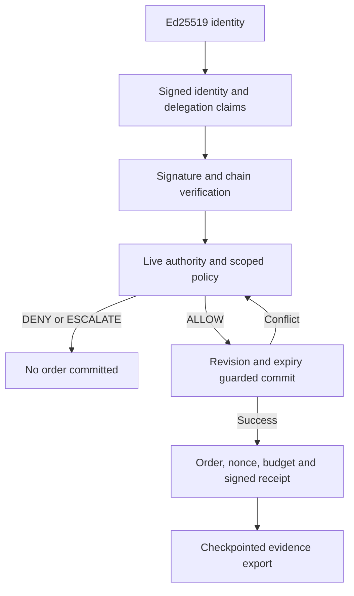

# Architecture

## Product decision

Generic agent passports are already a populated category. TrustCut makes the hard boundary visible: a valid identity and an earlier ALLOW must not survive a revoked mandate at execution. The unit of trust is a bounded action, not a general agent score.

## Trust topology

Northstar is the sandbox's pinned root issuer and human principal. It grants Atlas a $600 total stock-order mandate. Atlas delegates to Relay and Scout, each with a $300 per-order limit. Child capability scopes must narrow, never broaden. Each order debits all ancestors, so siblings cannot multiply the shared $600 allowance.

Harbor is the supplier agent. The buyer packet binds Harbor's DID as its audience; identity credentials establish both endpoints under Northstar. Witness issues a seeded domain-specific vouch for Harbor and signs audit events. This vouch is a sample signed relationship claim, not an earned marketplace reputation score.

## Data and protocol

Native WebCrypto creates Ed25519 keys and signs JWS. `did:key` embeds the Ed25519 public key with multicodec prefix 0xed01. Strict JWS headers pin algorithm, purpose, and key identifier. Identity, delegation, and vouch documents use a restricted VC 2.0 data shape signed as `vc+jwt`; action and audit messages use `trustcut+jwt`. There is no arbitrary remote DID resolver or schema fetch.

An intent signs a UUID request ID and nonce, actor, audience, action, resource, amount in integer cents, currency, purpose, issuance, expiry, and the delegation-chain hash. Identity and delegation issuers are checked against the sandbox root and each prior subject; a valid self-signature cannot enroll an attacker.

Policy checks holder proof, identities, audience, freshness, chain binding, signatures, ancestry, narrowing, expiry, depth, revocation, scope, ancestor budgets, status availability, scoped vouch, and exact-request human approval above $200. Untrusted or violated claims yield DENY. Unavailable status or a required human checkpoint yields ESCALATE. Neither changes the order ledger.

## Atomic execution boundary

The D1 table contains one aggregate per sandbox with a monotonic revision. Preparation records a decision but never creates an order. Execution reloads authority and checks policy again. It produces a candidate aggregate containing the order, consumed nonce, debits to every ancestor, Harbor's acceptance, and Witness's audit event.

The production SQL updates only the expected revision and only before the request/credential deadline, checked with SQLite's clock. If revocation commits first, stale execution cannot commit. The route reloads and re-evaluates the frozen signed intent, up to five attempts. If execution commits first, that completed order remains valid historical activity; later revocation does not undo it. This is linearized within one sandbox aggregate, not a claim of globally instantaneous distributed revocation.

Keeping order and authority in the same database avoids an external side-effect gap. A production payment connector would require an idempotent downstream commit protocol; this prototype does not execute external payments.

## Evidence

Audit receipts bind decision checks, actor, request, policy epoch, ledger hash, timestamp, and previous receipt hash. Harbor signs each accepted order. Witness signs the final checkpoint with audit count/head and ledger/credential hashes. The browser verifies locally, with a Noble verification fallback where WebCrypto is unavailable. The separate Node verifier uses native crypto with its own verification implementation. Both require independently pinned root/auditor keys.

A signed checkpoint detects modification, reordering, or truncation relative to that checkpoint. It cannot establish that a malicious operator did not issue an alternative history or conceal a newer checkpoint. Evidence verifies signatures and recorded claims, not an independent reconstruction of every historical policy decision.

## Code map

| Layer | Source |
|---|---|
| Encoding, DID keys, signatures | `lib/crypto.mjs` |
| Credentials, policy, actions, attacks | `lib/engine.mjs` |
| Atomic storage | `lib/repository.ts`, `drizzle/` |
| Session API | `app/api/lab/route.ts` |
| Browser verification | `lib/evidence.mjs` |
| Independent verification | `scripts/verify-evidence.mjs` |
| Visual lab | `components/trust-lab.tsx`, `app/globals.css` |
| Negative and commit tests | `tests/` |

## Deliberate scope

A single aggregate favors correctness and an inspectable demo over throughput. Per-agent external key custody, distributed status infrastructure, remote tool adapters, durable multi-tenant identity governance, credential rotation, and interoperability certification are future work. The prototype makes no network-scale latency or security certification claim.
